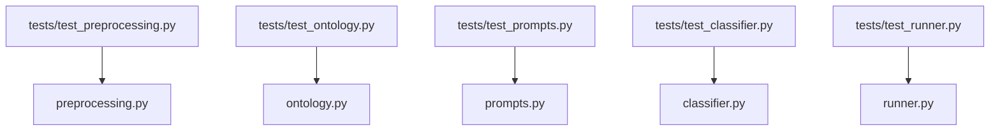

# Tests – Visual Overview / Vista Visual

[English](#english-version) • [Español](#spanish-version)

---

## English Version {#english-version}

### Test tree

```text
tests/
  conftest.py
  test_preprocessing.py
  test_ontology.py
  test_prompts.py
  test_classifier.py
  test_runner.py
```

### Mermaid – mapping tests to modules



---

## Versión en Español {#spanish-version}

### Árbol de pruebas

```text
tests/
  conftest.py
  test_preprocessing.py
  test_ontology.py
  test_prompts.py
  test_classifier.py
  test_runner.py
```

### Mermaid – mapeo pruebas → módulos


