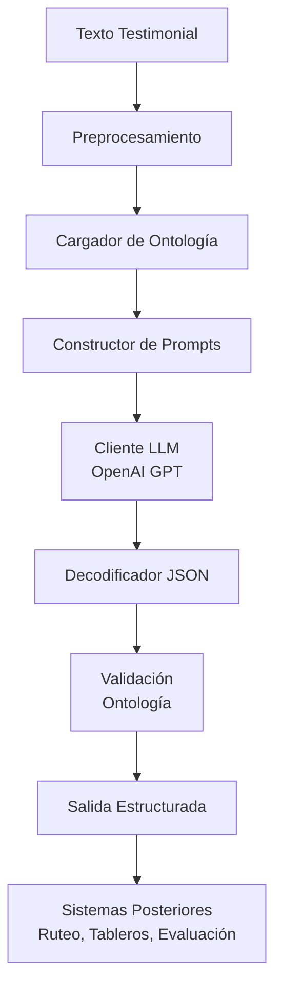

# Architecture / Arquitectura

[English](#english-version) · [Español](#spanish-version)

---

# English Version {#english-version}

## 1. High-Level Overview

This classifier is a modular LLM-based system designed for structured extraction of information from testimonial documents used by the **UBPD**.  
It implements:

- Controlled vocabulary classification  
- Ontology–driven prompts  
- Strict JSON schema validation  
- Modular preprocessing and parsing  
- Extensible architecture for evaluation, RAG, and APIs  

---

## 2. Component Breakdown

### 2.1 Preprocessing Layer
- Normalizes whitespace and Unicode  
- Optional: segmentation, light cleaning  
- Ensures clean, consistent input to the LLM  

### 2.2 Ontology Layer
- Loads `ontology_ubpd.yaml`  
- Validates expected fields  
- Produces flattened structures for prompts  

### 2.3 Prompt Construction Layer
- Builds system and user prompts  
- Injects ontology as controlled vocabulary  
- Enforces strict JSON structure  

### 2.4 LLM Invocation Layer
- Calls OpenAI GPT-family models  
- Configurable temperature and max tokens  
- Includes error handling (rate limits, incomplete JSON, retries)  

### 2.5 Validation and Post-Processing Layer
- Parses JSON  
- Validates fields against the ontology  
- Applies heuristic routing if present  

---

```markdown
## 3. Detailed Mermaid Diagram

<div class="mermaid">
flowchart TD
    A[Testimonial Input] --> B[Preprocessing]
    B --> C[Ontology Loader]
    C --> D[Prompt Builder]
    D --> E[LLM Client<br/>OpenAI GPT]
    E --> F[JSON Decoder]
    F --> G[Validation<br/>Ontology Constraints]
    G --> H[Structured Output]
    H --> I[Downstream Systems<br/>Dashboards, Routing, Evaluation]
</div>
```

---

## 4. Request Lifecycle (Extended)

1. Receive testimonial text  
2. Preprocess and normalize  
3. Load ontology  
4. Construct system and user prompts  
5. Request JSON classification from the LLM  
6. Retry if JSON incomplete  
7. Validate against ontology  
8. Return structured object  
9. Log for evaluation and debugging  

---

## 5. Extensibility

- Add evaluation module (precision, recall, confusion matrices)  
- Integrate RAG backends  
- Add vector search for cross-testimonial consistency  
- Deploy as API service  
- Add DB integrations  

---

# Versión en Español {#spanish-version}

## 1. Visión General

Este clasificador es un sistema modular basado en LLM diseñado para extraer información estructurada de documentos testimoniales utilizados por la **UBPD**.  
Incluye:

- Clasificación con vocabularios controlados  
- Prompts guiados por ontología  
- Validación estricta de JSON  
- Preprocesamiento y parsing modulares  
- Arquitectura extensible para evaluación, RAG y APIs  

---

## 2. Componentes del Sistema

### 2.1 Capa de Preprocesamiento
- Limpieza ligera  
- Normalización de caracteres  
- Entrada consistente para el modelo  

### 2.2 Capa de Ontología
- Carga `ontology_ubpd.yaml`  
- Valida categorías  
- Estructuras planas para inyección en el prompt  

### 2.3 Capa de Construcción de Prompts
- Prompt system + prompt user  
- Ontología como vocabulario permitido  
- Esquema JSON obligatorio  

### 2.4 Capa de Llamada al Modelo LLM
- Llamada a OpenAI GPT  
- Control de temperatura y tokens  
- Manejo de errores y reintentos  

### 2.5 Capa de Validación y Postprocesamiento
- Parseo de JSON  
- Validación contra la ontología  
- Cálculo opcional de reglas de ruteo  

---

## 3. Diagrama Detallado (Mermaid)



---

## 4. Ciclo de Petición (Extendido)

1. Recibir testimonio  
2. Preprocesar  
3. Cargar ontología  
4. Construir prompts  
5. Solicitar clasificación al LLM  
6. Reintentar en caso de JSON incompleto  
7. Validar etiquetas  
8. Devolver resultados estructurados  
9. Registrar para auditoría y evaluación  

---

## 5. Extensibilidad

- Módulo de evaluación  
- RAG  
- Búsqueda vectorial  
- Servicio API  
- Integración con bases de datos  
