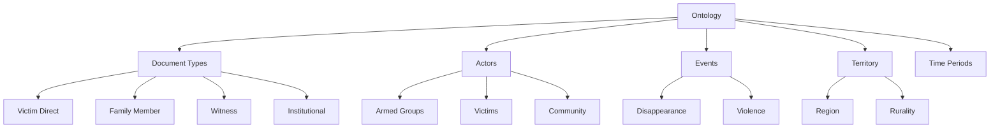
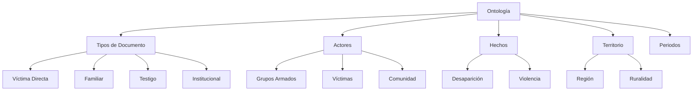

# Ontology / Ontología

[English](#english-version) • [Español](#spanish-version)

---

# English Version {#english-version}

## 1. Overview
This page documents the UBPD YAML ontology used by the classifier, including:
- Document types
- Events
- Actors
- Territory metadata
- Time periods
- Priority/routing criteria

## 2. Ontology Structure (YAML)
```yaml
document_types:
  - victim_direct
  - family_member
  - witness
  - institutional_document

actors:
  armed_groups:
    - FARC
    - AUC
    - ELN
    - Public Forces
  victims:
    - direct_victim
    - indirect_victim
    - community

events:
  disappearance:
    - forced_disappearance
    - kidnapping
  violence:
    - homicide
    - torture
    - threats

territory:
  region:
    - Antioquia
    - Meta
    - Cauca
    - Norte de Santander
  rurality:
    - rural
    - urban
    - mixed
```

## 3. Ontology Diagram (Mermaid)


## 4. How the Ontology Is Used
- Injected into system prompts
- Defines controlled vocabularies
- Validates model outputs
- Ensures consistency across classifications

## 5. Sample JSON Output
```json
{
  "document_type": "victim_direct",
  "actors": ["FARC", "direct_victim"],
  "events": ["forced_disappearance"],
  "territory": {
    "region": "Antioquia",
    "rurality": "rural"
  },
  "time_period": "1990-2000",
  "priority": "high"
}
```

---

# Versión en Español {#spanish-version}

## 1. Descripción General
Esta página documenta la ontología YAML utilizada por el clasificador UBPD, incluyendo:
- Tipos de documento
- Hechos
- Actores
- Territorio
- Períodos de tiempo
- Priorización y ruteo

## 2. Estructura de Ontología (YAML)
```yaml
document_types:
  - victima_directa
  - familiar
  - testigo
  - documento_institucional

actors:
  grupos_armados:
    - FARC
    - AUC
    - ELN
    - Fuerza Pública
  victimas:
    - victima_directa
    - victima_indirecta
    - comunidad

events:
  desaparicion:
    - desaparicion_forzada
    - secuestro
  violencia:
    - homicidio
    - tortura
    - amenazas

territorio:
  region:
    - Antioquia
    - Meta
    - Cauca
    - Norte de Santander
  ruralidad:
    - rural
    - urbano
    - mixto
```

## 3. Diagrama de Ontología (Mermaid)


## 4. Uso de la Ontología
- Inyectada en el system prompt
- Define vocabularios controlados
- Valida las salidas del modelo
- Asegura consistencia en clasificaciones

## 5. Ejemplo de JSON Esperado
```json
{
  "tipo_documento": "victima_directa",
  "actores": ["FARC", "victima_directa"],
  "hechos": ["desaparicion_forzada"],
  "territorio": {
    "region": "Antioquia",
    "ruralidad": "rural"
  },
  "periodo": "1990-2000",
  "prioridad": "alta"
}
```
